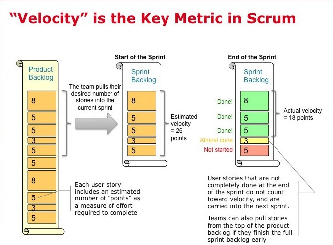
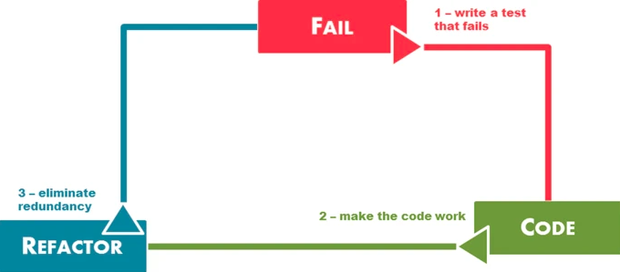
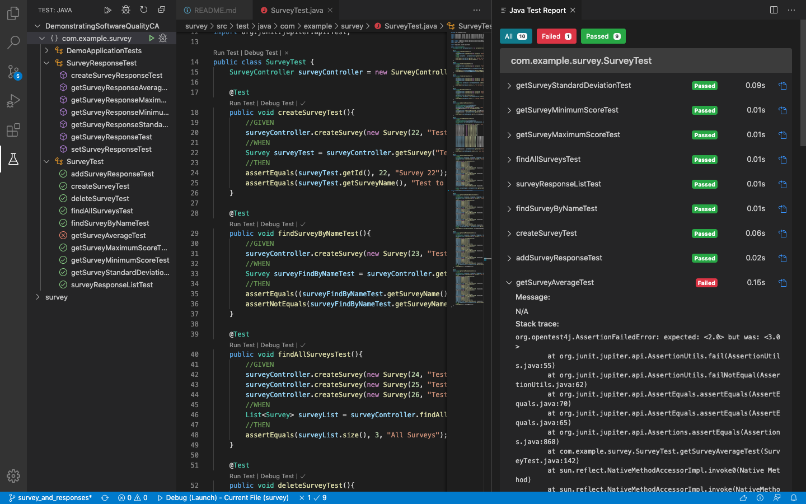

# Demonstrating Software Quality - Survey

## Introduction
This project provides a list of guidelines for the best practices to refer to during the development of a standard industry Software Project.

Before starting to code any standard software development project there are numerous components that need to be considered first. These componets include the following:

- Scrum Sprint Backlog and Task Estimation
- Unit Testing and Test-Driven Development
- Test Coverage Metric
- Team Version-Control
- Code-Review Checklist

In this project I am required to create a software component for storing information about Surveys and Responses. However, this component does not require a user interface or external storage. The main objective of this assignment is to highlight the best practices to follow with a focus on writing unit tests to identify if the code is correct while also following a GitFlow process.

## Scrum Sprint Backlog and Task Estimation
Sprint Backlog contains a list of tasks that a team targets to deliver during a sprint in order to reach the sprint needed to be completed within the sprint. Ideally, the Sprint Backlog items are taken directly from the product backlog. The Sprint Backlog identifies a set of tasks and to-do items for the developers to complete in the upcoming sprint. A sprint has generally a fixed time period of 2 weeks. The tasks in a sprint are identified before the initial sprint start date. The Sprint Backlog is a highly-visible, real-time picture of the work that the development team plans to complete throughout the Sprint block.

### Sprint Backlog
For this assignment I plan to get the following story tasks completed within one sprint i.e. within the 2 weeks. 

1. **Set up the Development Environment**
- Create Workspace in Visual Studio Code.
- Link GitHub to project in Visual Studio Code: enable git flow process.
- **Story Point =** 1

2. **Create a Project Plan**
- Develop a plan in order to identify the tasks involved to successfully complete this project.
- Prioritise Sprint Backlog. 
- Estimate the time for each task using Story Points. 
- **Story Point =** 2

3. **Create Survey Model** 
- Survey model contains an id, name and a list of Survey Responses.
- Each variable has a corresponding getter method.
- **Story Point =** 1

4. **Create Survey Response Model**
- Survey Response model contains an id, response and a list of Survey Responses.
- Each variable has a corresponding getter method.
- Method to add a response
- **Story Point =** 1    

5. **Create Survey Service Class**
- Use @Service annotation.
- Includes Unit Tests for below methods following TDD: 
    - getAllSurveys() -> returns Survey list.
    - getSurveyByName() -> returns specific Survey.
    - createSurvey() -> create and adds a new Survey to the list of Surveys. 
    - deleteSurvey() -> deletes and removes a Survey from the list of Surveys.
    - addSurveyResponse() -> add a Survey Response to the list. 
- **Story Point =** 5

6. **Create Survey Controller Class**
- Use @Controller annotation.
- Methods contains request mappings. 
- Includes Unit Tests for below methods following TDD: 
    - getAllSurveys() -> get all Surveys.
    - getSurveyByName() -> get Survey with specific name. 
    - createSurvey() -> creates new Survey.
    - deleteSurvey() -> delete a Survey.
    - addSurveyResponse() -> add Survey Response to the list. 
- **Story Point =** 5

7. **Create Survey Response Service Class**
- Use @Service annotation.
- Includes Unit Tests for below methods following TDD: 
    - setResponse() -> submits response for a Survey Response.
    - getSurveyResponses() -> returns all responses of a Survey Response.
    - createSurveyResponse() -> submits new response to a Survey Response. 
 - **Story Point =** 5

8. **Create Survey Response Controller Class**
- Use @Controller annotation.
- Methods contains request mappings. 
- Includes Unit Tests for below methods following TDD: 
    - setResponse() -> submits response for a Survey Response.
    - getSurveyResponses() -> returns all responses of a Survey Response.
    - createSurveyResponse() -> submits new response to a Survey Response. 
- **Story Point =** 5

9. **Add Summary Calculation to Survey**
- Include Unit Tests for below methods following TDD.
- Survey Service and Survey Controller contains the following:
    - getSurveyAverage() -> returns average result of a Survey. 
    - getSurveyStandardDeviation() -> return the standard deviation result of a Survey. 
    - getSurveyMinimumScore() -> returns minimum score for a Survey.
    - getSurveyMaximumScore() -> returns maximum score for a Survey.
- **Story Point =** 5

10. **Add Summary Calculation to Survey Response**
- Include Unit Tests for below methods following TDD.
- Survey Response Service and Survey Response Controller contains the following:
    - getSurveyResponseAverage() -> returns average result of a Survey Response. 
    - getSurveyResponseStandardDeviation() -> return the standard deviation result of responses for a Survey Response. 
    - getSurveyResponseMinimumScore() -> returns minimum score for a Survey Response.
    - getSurveyResponseMaximumScore() -> returns maximum score for a Survey Response.
 - **Story Point =** 5

 11. **Finish the Documentation**
- Test Coverage Metric - Provide screenshot.
- Team Version Control - Describe branches created. 
- Create Code Review Checklist - Give example of where I followed this checklist in a Pull Request.
 - **Story Point =** 3

 ### Task Estimation
 Task Estimation can be extremely difficult. Everyone on the team is involved in the estimation process as each member brings a different perspective on the product and work required to deliver a user story/ task. 

 In the Sprint Backlog, I defined the stories/tasks that are needed to successful complete this project. 
 Using story points I estimated the relative effort of work involved in each task using the Fibonacci Sequence: 0, 1, 2, 3, 5, 8, 13, 21, etc. During the estimation process each team members estimates are compared and if the estimate result varys a discussion between the team needs to be had in order to agree on an estimate everyone is happy to settle with. 

**Points** |**Meaning**
------------ | -------------
0 | Very Quick and Easy to Deliver - No Complexity
1 | Quick To Deliver - Minimal Complexity, Know exactly what needs to be done
2 | Quick To Deliver - Some Complexity, Know what needs to be done but improvements/ changes may take time.
3 | Moderate Time To Deliver - Moderate Complexity, Could contain unknowns
5 | Longer Time to Deliver - High Complexity, Contains unknowns
8 | Long Time to Deliver - High Complexity, Contains many unknowns. Should try to break down into smaller tasks. 
13 | Long Time to Deliver - High Complexity, Contains many critical Unknowns. Like an 8; discuss ways to break it down into smaller tasks.  
21 | Danger Zone - Find a way to break down the complexity into smaller tasks.

**Comparison of Two Story Tasks - For Example:** 

**Third Story Task**       | **Sixth Story Task**
-------------------------- | ------------------
Create Survey Model        | Create Survey Controller Class
 Survey model contains an id, name and a list of Survey Responses. | Use @Controller annotation.
 Each variable has a corresponding getter method. |  Methods contains request mappings. 
... |  Includes Unit Tests for below methods following TDD: 
... |   getAllSurveys() -> get all Surveys.
... |   getSurveyByName() -> get Survey with specific name. 
... |   createSurvey() -> creates new Survey.
... |   deleteSurvey() -> delete a Survey.
... |   addSurveyResponse() -> add Survey Response to the list. 
Story Point = 1 | Story Point = 5

Comparison 
- The 3rd Story Task: Create Survey Model has an estimated number of story points = 1. This task is straight forward and requires minimal amount of time/ effort. I could have gave it an estimate of 0, however I factored in the requirement to create an ArrayList of Survey Responses within the Survey Class.

- However, the 6th story task: Create Survey Controller Class has an estimated number of story points = 5. This story task in comparison to the 3rd story, involves a larger amount of work due to higher complexity and the unknowns that may be discovered throughout the development. 

### Velocity Metrics:
Velocity is a measure of the amount of work a team can accomplish during a sprint. It is calculated at the end of a sprint by adding up all the story points given to each feature, user story or backlog item that is successfully delivered within a sprint. If a sprint backlog item isn't completely finsihed within the sprint, it is carried over to the next sprint and it doesn't count in the velocity calculation. This allows the team to accurately predict the amount of stories they will realistically get to complete in the next sprint. 

Below is an image describing how Velocity is calculated:

## Unit Testing and Test-Driven Development
Test Driven Development is the process of Software Development where you first write a test that fails before writing the implementation code. This process results in improved design qualities while avoiding  duplication of code as this process promotes writing a small amount of code at one time in order to get the test to pass.

For each code feature developed I followed the TDD process. Unit tests were written for the testing purposes of this project. 
This included a step to step guide on how I created each feature within this project. 

Each commit included an individual test along with code to support the functionality:
1. Write a single test method in the corresponding Test class.
2. Test will fail - which is expected as no code to support this feature.
3. Write just enough code for the functionality in the Survey (Response) Service and Controller class in order for the test to pass.
4. Test Passes.
5. Refactor - if necessary to meet the code review checklist requirements. 
6. Repeat for the next feature.
- [Get All Surveys - Commit Example ](https://github.com/niamhmc99/DemonstratingSoftwareQualityCA/pull/11)

## Test Coverage Metric

Test coverage is one of the many fundamental metrics in Software Development used to analyse, track and measure the quality of code written in a software project. 

Test coverage is defined as a metric that measures the extent to which the code developed is tested using a test suite.

The Test Coverage Metric used in this project is [Java Test Runner: vscode-java-test](https://github.com/microsoft/vscode-java-test). This is a lightweight extension that allows the user to Run and debug JUnit or TestNG test cases in Visual Studio Code. 

The features include:
- Run/Debug Test Cases.
- Customize Test Configurations
- View Test Report.
- View Tests in Test Explorer. 
- Show Test Logs.

Example of the Java Test Runner running:

- Shortcuts are available to 'Run Test/ Debug Test' above the class and above each method which allows you to run a single test case for a method. 
- Test Explorer on the left hand side displays all the test cases within the project. If you click on specific test case it will direct you to the source code. 
- The status bar at the bottom shows the final results after the test case(s) has been ran/debugged. If you click on the result it will navigate you to the Test Report. 
- If a test case fails a description of the error is given which helps identify the root cause of the problem to the user. E.g. getAverageSurveyTest() in the screenshot above. 

## Team Version-Control  

The GitFlow process was followed throughout to ensure a smooth running process in the project.  

**Master** 

This branch is where the finalized project is located. This includes all the necessary documentation and code for the project. Pull requests from the survey_and_responses are only allowed here as this is the developing branch. This branch is familiar to every user.  

**Develop - Survey_and_responses** 

This branch acts as the **develop branch** for my project. This defines the developing phase with the addition of feature branches created off it. It reflects the state of the latest development  delivered which is ready for the next release. This branch only accepts pull requests from feature branches. Once the code has reached a suitable state for it to be released to production it is merged back into the master branch.  

**Feature Branches** 

These separate branches branch of the survey_and_responses which is the develop branch for the project. Once the necessary code is implemented they are merged back into this develop branch.  

These branches are used for the addition of new features.  

These features include the following:  

- add_survey_response 
- create_survey 
- create_survey_response 
- delete_survey 
- find_all_surveys 
- find_survey_by_name 
- get_survey_average 
- get_survey_max_score 
- get_survey_min_score 
- get_survey_response 
- get_survey_response_average 
- get_survey_response_maximum_score 
- get_survey_response_minimum_score 
- get_survey_response_standard_deviation 
- get_survey_standard_deviation 
- set_survey_response 

Each of these branches represent a new feature that follows a Test-Driven development approach which includes a test and the necessary code needed to develop the associated feature.  

**Hotfix Branches** 

If a bug is encountered anywhere in piece of live production code a Hotfix branch can be created. The naming of this branch includes the version of where the bug occurs in the corresponding tag from the master branch. Overall, this allows other team members to continue developing off the develop branch while someone fixes the current bug.  

## Code-Review Checklist

Code review is an essential activity part of the Software Quality Assurance. This is where the source code is broken into small pieces an inspected by one or more team member(s). Code review is done in order to detect mistakes, catch early bugs and ensure that the code follows the standard practices. Implementing code reviews is one of the relatively cheapest ways to detect and reduce bugs at an early stage.

As this is an individual assignment I will review and accept my own Pull Requests. However, before merging each (feature) branch I will inspect my own work and ensure I have ticked of each item in my Code Review Checklist.  

Before carrying out a Code Review identify wheter this is:

1. Minor change - grammer, syntax, refactoring code which doesn't require new tests.
2. Code change that is covered by existing test - therefore no new test is needed to be written.
3. Code change that is new - and needs new test case to be written. 

Identifying what type of code review it is will help highlight the main areas to pay attention while going through the below checklist. 

Code Review Checklist: 
- [ ] Adequate white space and indentation?
- [ ] Correct use of syntax? 
- [ ] Access modifiers used correctly?
- [ ] Does the naming convention make sense and do they have meaning?
- [ ] Does the code make sense? Is it readable? If some code is unclear, is there a code comment to signify the function of the code?
- [ ] Is there associated unit tests? If not, why not?
- [ ] Are unit tests passing? If not, why not?
- [ ] Is there adequate description in the pull request title?
- [ ] Does one method have one specific action? Do I need to split the method into two methods? 
- [ ] Is there any repeated code/ duplication of code? 

Suggest a checklist of things that a reviewer should check when reviewing a Pull Request. Link to a closed Pull Request within your project that demonstrates this list was followed (e.g. by leaving a comment on the Pull Request). 

#### Pull Request 
A pull request is a method of submitting your work to an open project. The use of good pull requests within a team's workflow enhances the overall team productivity while minimizing frustration that can occur when an error occurs. 

Pull Requests are proven to be more beneifical when they are kept small, occur frequently and are easy to review and test. 

When creating a Pull Request keep the following in mind:

- Create a pull request name that is meaningful.
- Ensure that only one issue is addressed. 
- Create a commit with a meaningful commit message. 

Here is an example where I have accepted my own pull request while following the code review checklist. 

[Create Survey - Pull Request Example](https://github.com/niamhmc99/DemonstratingSoftwareQualityCA/pull/7)