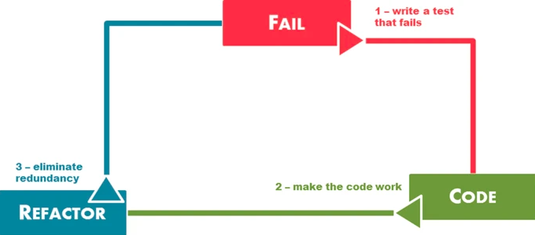

# Demonstrating Software Quality - Survey

## Introduction
This project provides a  list of guidelines for the best practices to refer to during the development of a Software Project. The steps involved within the standard development 
Before starting to code any standard software development project there are numerous components that need to be considered first. 

## Scrum Sprint Backlog and Task Estimation
Sprint Backlog contains a list of tasks that a team targets to deliver during a sprint in order to reach the sprint needed to be completed within the sprint. Ideally, the Sprint Backlog items are taken directly from the product backlog. The Sprint Backlog identifies a set of tasks and to-do items for the developers to complete in the upcoming sprint. A sprint has generally a fixed time period of 2 weeks. The tasks in a sprint are identified before the initial sprint start date. The Sprint Backlog is a highly-visibible, real-time picture of the work that the development team plans to complete throughout the Sprint block.

### Sprint Backlog

1. **Set up the Development Environment**
- Create Workspace in Visual Studio Code.
- Link GitHub to project in Visual Studio Code: enable git flow process.
- **Story Point =** 1

2. **Create a Project Plan**
- Develop a plan in order to identify the tasks involved to successfully complete this project.
- Prioritise Sprint Backlog. 
- Estimate the time for each task using Story Points. 
- **Story Point =** 2

3. **Create Survey Model** 
- Survey model contains an id, name and a list of Survey Responses.
- Each variable has a corresponding getter method.
- **Story Point =** 1

4. **Create Survey Response Model**
- Survey Response model contains an id, response and a list of Survey Responses.
- Each variable has a corresponding getter method.
- Method to add a response
- **Story Point =** 1    

5. **Create Survey Service Class**
- Use @Service annotation.
- Includes Unit Tests for below methods following TDD: 
    - getAllSurveys() -> retruns Survey list.
    - getSurveyByName() -> returns specific Survey.
    - createSurvey() -> create and adds a new Survey to the list of Surveys. 
    - deleteSurvey() -> deletes and removes a Survey from the list of Surveys.
    - addSurveyResponse() -> add a Survey Response to the list. 
- **Story Point =** 5

6. **Create Survey Controller Class**
- Use @Controller annotation.
- Methods contains request mappings. 
- Includes Unit Tests for below methods following TDD: 
    - getAllSurveys() -> get all Surveys.
    - getSurveyByName() -> get Survey with specific name. 
    - createSurvey() -> creates new Survey.
    - deleteSurvey() -> delete a Survey.
    - addSurveyResponse() -> add Survey Response to the list. 
- **Story Point =** 5

7. **Create Survey Response Service Class**
- Use @Service annotation.
- Includes Unit Tests for below methods following TDD: 
    - setResponse() -> submits response for a Survey Response.
    - getSurveyResponses() -> returns all responses of a Survey Response.
    - createSurveyResponse() -> submits new response to a Survey Response. 
 - **Story Point =** 5

8. **Create Survey Response Controller Class**
- Use @Controller annotation.
- Methods contains request mappings. 
- Includes Unit Tests for below methods following TDD: 
    - setResponse() -> submits response for a Survey Response.
    - getSurveyResponses() -> returns all responses of a Survey Response.
    - createSurveyResponse() -> submits new response to a Survey Response. 
- **Story Point =** 5

9. **Add Summary Calculation to Survey**
- Include Unit Tests for below methods following TDD.
- Survey Service and Survey Controller contains the following:
    - getSurveyAverage() -> returns average result of a Survey. 
    - getSurveyStandardDeviation() -> return the standard deviation result of a Survey. 
    - getSurveyMinimumScore() -> returns minimum score for a Survey.
    - getSurveyMaximumScore() -> returns maximum score for a Survey.
- **Story Point =** 5

10. **Add Summary Calculation to Survey Response**
- Include Unit Tests for below methods following TDD.
- Survey Response Service and Survey Response Controller contains the following:
    - getSurveyResponseAverage() -> returns average result of a Survey Response. 
    - getSurveyStandardDeviation() -> return the standard deviation result of responses for a Survey Response. 
    - getSurveyMinimumScore() -> returns minimum score for a Survey Response.
    - getSurveyMaximumScore() -> returns maximum score for a Survey Response.
 - **Story Point =** 5

 11. **Finish the Documentation**
- Test Coverage Metric - Provide Screenshot.
- Team Version Control - describe branches created. 
- Create Code Review Checklist.
 - **Story Point =** 2

 ### Task Estimation
 Task Estimation can be extrememly difficult. Everyone on the team is involved in the estimation process as each member brings a different perspective on the product and work required to deliver a user story/ task. 

 In the Sprint Backlog, I defined the stories/tasks that are needed to successful complete this project. 
 Using story points I estimated the relative effort of work involved in each task using a Fibonacci Sequence: 0, 1, 2, 3, 5, 8, 13, 21, etc. 

**Points** |**Meaning**
------------ | -------------
0 | Very Quick and Easy to Deliver - No Complexity
1 | Quick To Deliver - Minimal Complexity, Know exactly what needs to be done
2 | Quick To Deliver - Some Complexity, Know what needs to be done but improvements/ changes may take time.
3 | Moderate Time To Deliver - Moderate Complexity, Could contain unknowns
5 | Longer Time to Deliver - High Complexity, Contains unknowns
8 | Long Time to Deliver - High Complexity, Contains many unknowns. Should try to break down into smaller tasks. 
13 | Long Time to Deliver - High Complexity, Contains many critical Unknowns. Like an 8; discuss ways to break it down into smaller tasks.  
21 | Danger Zone - Find a way to break down the complexity into smaller tasks.

**For example:** 

The 3rd story task: Create Survey Model has an estimated number of story points = 1. This task is straight forward and requires minimal amount of time. However, the 6th story task: Create Survey Controller Class has an estimated number of story points = 5. This story task in comparison to the 3rd story, involves a larger amount of work due to higher complexity and the unknowns that may be discovered throughout the development. 

### Velocity Metircs:
Velocity is a measure of the amount of work a team can accomplish during a sprint. It is calculated at the end of a sprint by adding up all the story points given to each feature, user story or backlog item that is successfully delivered within a sprint. This allows the team to accurately perdict the amount of stories they will realistically get to complete in the next sprint. 

## Unit Testing and Test-Driven Development
Test Driven Development is the process of software development where you first write a test thats fails before writing the implementation code.

## Test Coverage Metric

## Team Version-Control 

## Code-Review Checklist

